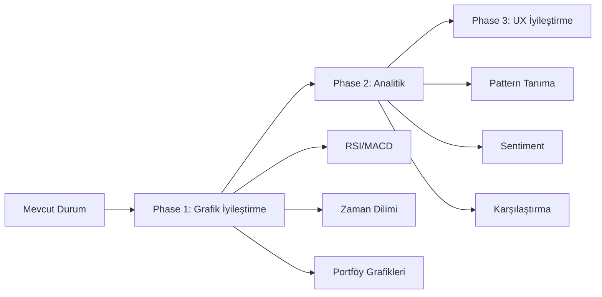

# Proje Özellik Önerileri

## 📊 Grafik Özellikleri (Öncelik 1)

### 1.1 Gelişmiş Grafik Görselleştirmeleri
| Özellik | Açıklama | Kütüphane | Öncelik |
|---------|----------|-----------|---------|
| **Candlestick Grafikleri** | Mum grafikleri ile fiyat gösterimi | lightweight-charts (mevcut) | ✅ Mevcut |
| **Teknik İndikatörler** | RSI, MACD, Bollinger Bands | TradingView indicators | Yüksek |
| **Çizim Araçları** | Trend çizgileri, Fibonacci | lightweight-charts drawing | Orta |
| **Zaman Dilimi Seçimi** | 1D, 1H, 4H, 1W, 1A | Custom UI | Yüksek |

### 1.2 Portföy Grafikleri
- 📈 **Portföy Performans Grafiği** - Zaman içinde toplam değer değişimi
- 🥧 **Dağıım Pie Chart** - Sektör/şirket bazlı portföy dağılımı
- 📊 **Getiri Karşılaştırma** - Benchmark (BIST-100) ile karşılaştırma

### 1.3 Piyasa Görselleştirmeleri
- 🗺️ **Heat Map** - Sektör bazlı ısı haritası (yeşil=kazanç, kırmızı=kayıp)
- 📊 **Performans Tablosu** - En çok kazanan/kaybeden hisseler

---

## 🧠 Analitik Özellikler (Öncelik 2)

### 2.1 Teknik Analiz
- **Otomatik Pattern Tanıma** - Formasyon algılama (bayrak, omuz-baş-omuz)
- **Signals Panel** - Alım/satım sinyalleri
- **Moving Averages** - Hareketli ortalamalar (MA 50, 200)

### 2.2 Temel Analiz
- **Finansal Oranlar Panel** - F/K, FD/FA, Net Borç/FA
- **Trend Analizi** - Gelir, kar, büyüme trendleri
- **Karşılaştırmalı Analiz** - Şirketleri sektör ortalamasıyla karşılaştırma

---

## 📰 Haber & Bilgi (Öncelik 2)

### 3.1 Gelişmiş Haber Özellikleri
- 📰 **Sentiment Analizi** - Haberlerin pozitif/negatif puanı
- 🏷️ **Etiket Bulutu** - Konu bazlı haber kategorileri
- 🔗 **İlişkili Haberler** - Şirket haberlerini bağlama göre grupla

### 3.2 Ekonomik Takvim
- 📅 **Ekonomik Göstergeler** - Faiz kararları, enflasyon verileri
- ⏰ **Yaklaşan Etkinlikler** - Önemli veriler için bildirim

---

## 🔔 Uyarı & Bildirim (Öncelik 3)

### 4.1 Fiyat Uyarıları (mevcut)
- 📊 Belirli fiyat seviyesinde bildirim

### 4.2 Yeni Öneriler
- 📈 **Teknik Sinyal Uyarıları** - RSI aşırı alım/satım
- 📰 **Haber Uyarıları** - Şirket haberi geldiğinde bildirim
- 📊 **Portföy Eşik Uyarıları** - %X kayıp/kazançta bildirim

---

## 📱 UX/UI İyileştirmeleri

### 5.1 Mobil Uyumluluk
- 📱 Responsive grafikler
- Dokunmatik gesture desteği

### 5.2 Performans
- ⚡ Lazy loading grafik verileri
- 💾 Veri caching (localStorage)

---

## 🎯 Önerilen Yol Haritası

---

## 📦 Gerekli Yeni Bağımlılıklar

| Kütüphane | Kullanım | Kurulum |
|-----------|----------|---------|
| `lightweight-charts` | ✅ Mevcut | - |
| `@tanstack/react-query` | Veri caching | `npm i @tanstack/react-query` |
| `recharts` | Pie/Bar chart | `npm i recharts` |
| `trading-signals` | Teknik indikatörler | `npm i trading-signals` |

---

## 🚀 Hızlı Kazanımlar (Quick Wins)

1. **Zaman dilimi seçici** ekleme - 1D/1H/4H/1W/1A
2. **Portföy pie chart** - Sektör dağılımı
3. **Heat map** basit versiyonu - Sektör performansı
4. **RSI paneli** - Mevcut grafiğe ekle

---

*Oluşturulma: 22 Mart 2026*
